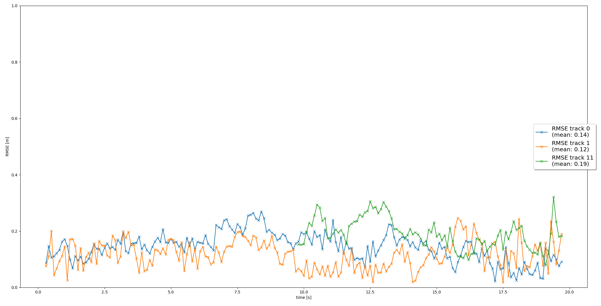
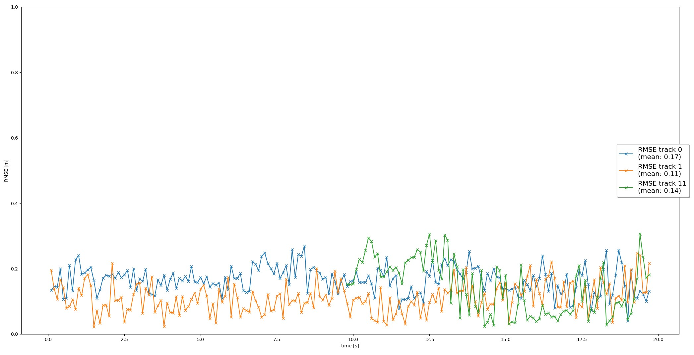

## 3D object tracking using sensor fusion of Camera/LiDAR and Extended Kalman Filters
The following tasks were implemented:
* Kalman Filter code:
  * implemented functions that return State update matrix F() with state covariance Q();
  * implemented methods predict() and update() that update mean x and covariance P for the tracks during prediction and measurement update steps respectively;
* Track management:
  * replaced the initialization values for x and P of the Track using the data from the initial LiDAR measurement. Sensor-to-vehicle coordinates transformation was used here;
  * implemented track management handle_updated_track() method that updates 'state', 'score' and 'last_updated' attributes when the Track data is updated using Kalman update step;
  * implemented track management manage_tracks() method that handles unassigned tracks and measurements and reduces 'score' and 'last_updated' attributes of the Track, deletes the Track if necessary;
  * the Track is deleted when any of the following conditions is met:
    * covariance matrix P values are above the threshold;
    * score drops below 'params.delete_threshold' value (no matter the 'state' value of Track is)
    * confirmed track's score drops below 'params.c_delete_threshold' value
    * track's 'last_updated' attribute drops below 'params.last_updated' value. This attribute marks the number of consecutive times the track was not updated by any sensor measurements (due to out of FOV for example)
* Association code:
  * association_matrix was replaced by the actual association matrix based on Mahalanobis distance values in the associate() method. unassigned_tracks and unassigned_meas lists were set as well;
  * MHD() method was implemented. It returns the Mahalanobis distance;
  * gating() method was implemented. It checks if the measurement lies inside a track's gate. If true, it sets the Mahalanobis distance to the repective track/measurement position of the association matrix. Otherwise, the value is set to infinity;
  * get_closest_track_and_meas() method was implemented to return the track and measurement ids that correspond to the lowest value in the association matrix;
* Sensor class code:
  * in_fov() method was implemented to check weather the state mean x is in FOV of the sensor;
  * get_hx() method for the Camera sensor was implemented;
  * Removed the LiDAR only restriction for the measurements in the generate_measurement() method;
  * initialized z, R attributes for the Camera sensor;
* Generated RMSE metrics plot for all the completed tasks: 
   
  EKF to track a single target using LiDAR measurements
   
  Track management
   
  Association task
   
  EKF to track a single target using LiDAR measurements
* Recorded a video of the results ("img/output.avi");

Tracks management implementation was the most difficult part of the project as it required lots of work to tune the process so that the tracks weren't deleted because of the temporal absense of measurements. At the same time it was necessary to remove old tracks when necessary without delays.
I've also added another parameter for that: 'last_updated'. It shows the consecutive number of times when the sensors skipped the track updates. In this case such tracks were not deleted when they appeared in the area that is out of FOV of both sensors.

Sensor fusion allows to continue object tracking when one of the sensors fails to obtain the measurements. It's quite beneficial to use the sensor fusion for the Kalman Filter accuracy.

Different occlusions, bad weather conditions, clutter FP measurements always occur during the sensor work. In the current dataset there were several "fantom" objects that needed to be filtered. A few occlusions of the vehicles also took place from time to time.

There are several ways of improving the current tracking results:
* Add more data from other sensors;
* Use different Kalman Filter model for the state estimation;
* Tune the initialization parameters of the Kalman Filters;
* Use better algorithms for the association problem solution;
 
